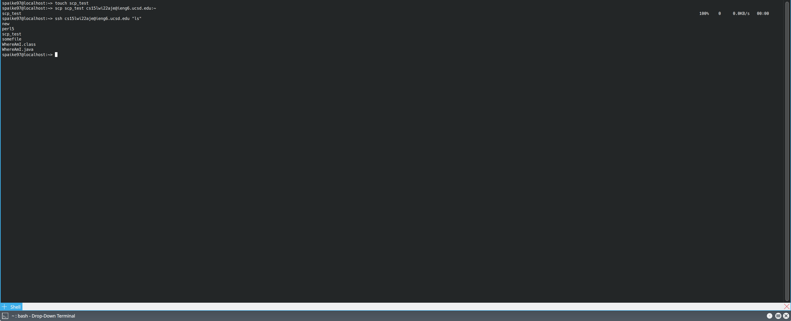

# CSE15L Lab 1 Guide

Greetings from the past. In this guide, I'll walk you through the process of finishing the first lab in CSE 15L, as well as some points that me and my class mates found
confusing. But before we start, I would like to bring to your attention that: 

***OpenSUSE is the best linux distro! Be sure to check out OpenSUSE.***

---

Below are the topics that we will be covering today:

```
* Installing VS Code 
* Remotely Connecting
* Trying Some Commands
* Moving Files with `scp`
* Setting an SSH Key
* Optimizing Remote Running
```

# Installing VS Code

In this step, we will be installing VS Code.

VS Code is an awesome editor made by Microsoft. It offer great cross-platform support, and is highly customizable through is built-in extension marketplace. It is simple,
versitile, and gets the job done. To download VS Code, follow the link here: [Link](https://code.visualstudio.com/download).


My fellow OpenSUSE users may also opt to use Microsoft's repo and let our package manager do the work for us, by using the following codes:

```
sudo rpm --import https://packages.microsoft.com/keys/microsoft.asc
sudo zypper addrepo https://packages.microsoft.com/yumrepos/vscode vscode
sudo zypper refresh
sudo zypper install code
```

If you run into any trouble installing VS Code, remember Google is your friend -- If you are facing this issue, chances are someone else has already had.

# Remotely Connecting

In this step, we will be connecting to UCSD's remote server using your class account, and this handy little tool called `ssh`.

First, look up your course-specifc account for CSE15L here:

[Link](https://sdacs.ucsd.edu/~icc/index.php) (Be sure to reset your password so as to activate your account, and allow about 15 minutes to let the activation go through)

Then, open your preferred terminal emulator and enter:

```
ssh cs15l*@ieng6.ucsd.edu
```

Be sure to replace * with the quarter in which you are in at the moment followed by your course specific identifier. For example, if you are currently in the winter
quarter of year 2023, and your identifier is xyz, then enter: (Notice that the course identifier is cs15l, not cse15l, for some reason)

```
ssh cs15lwi23xyz#ieng6.ucsd.edu
```

Since it's the first time you are connecting to the server, the terminal will likely tell you something along the line of the following:

```
The authenticity of host 'ieng6.ucsd.edu (128.54.70.227)' can't be established.
RSA key fingerprint is SHA256:ksruYwhnYH+sySHnHAtLUHngrPEyZTDl/1x99wUQcec.
Are you sure you want to continue connecting (yes/no/[fingerprint])?
```

If you see this message on your first connection to this server, it's expected, and you will be fine if you just say yes. If you see this message while connecting to a 
server that you frequent, be careful! Eve may be listening. 

Enter yes and press enter, and the terminal will proceed to ask for your password. Enter your password and press enter again. Don't be surprised if your terminal does not
show anything as you type in your password. It's just a safety feature.


If things go smoothly, welcome message will be displayed. If so, congradulations! You have just connected to a computer in the CSE basement. If not, double check if you
connected to the correct server, your password is correct, and you have waited about 15 minutes after activating your course account. You have double checked all of these, 
and the connection still doesn't go through, feel free to let your TA know, and s/he will help you out.

---

# Trying Some Commands

In this step, we will be trying out some basic commands in our remote server. Here are some basic commands to get you started with getting around in a *nix environment.

* Find out where you are: pwd
* Find out the contents of the current directory: ls
* Go to a certain directory: cd (path to that directory)
* Copy a file to another location: cp (path to file/name of file) (path to target/new name for copied file)
* Print out the content of a file: cat (path to file/name of file) 
* To edit a file: vim (path to file/name of file)

As you may have learned in CSE 8/11, we can pass in special arguments for command line programs to let them to special things.

e.g., try the following commands, and see how their outputs are different than just entering `ls`?
```
ls -a
ls -l
ls -t
```

Typically, a command line program always has a `-h` or `-help` options to tell you about how it works. Alternatively, you may opt to try `man (command)` to access its
mannual for more detailed instruction. However, sometimes you just want some super basic instructions on how to get it started. In that case: I recommend this nice
little program called tldr (not installed on remote server as of today, but you are free to install it on your own computer). It does exactly what its name suggest:
a too long don't read summary of what a command does!


Bonus: Do you want to know which distro our remote server is running on? Run the following command:
```
cat /etc/os-release 
```

---

# Moving Files with `scp`

In this step, we will be moving files from our local machine to our remote server, using `scp`.

SCP stands for Secure Copy Protocol, and as you may have guessed, it's function is to copy files (relatively) securely. The way scp command works is more or less
similar to cp command. It follows the pattern of:

```
scp source destination 
```

Let's try an example. Create the following file on your local computer, and name it `WhereAmI.java`.

```
class WhereAmI {
  public static void main(String[] args) {
    System.out.println(System.getProperty("os.name"));
    System.out.println(System.getProperty("user.name"));
    System.out.println(System.getProperty("user.home"));
    System.out.println(System.getProperty("user.dir"));
  }
}
```

Now, on your terminal on your local computer, cd to the location of `WhereAmI.java`, and run the following:

```
scp WhereAmI.java (youraccount)@ieng6.ucsd.edu:~/
```

The terminal may prompt you to provide password. Provide as required when prompted.

Now ssh into your remote account, and try `ls`, and you should find `WhereAmI.java` to be there. Now you can edit, compile or do whatever you wish with this file on your
remote computer.



# SSH Keys

In this step, we will be setting up your ssh key to make the ssh/scp process more streamlined.

Notice how you have to prove your identity through entering password everytime you ssh/scp into your remote account, even though you have been doing it in a row for
five, six times in a row already? Doesn't it get frustrating that the remote server couldn't seem to remember your identity and just let you in?

Well, frustrate no more, because we will be eliminating the need for this in this step, by providing our remote server with a unique, hard-to-fake token that represents 
our identity. Think of it as us providing our finger print to the server. This way, whenever we ssh/scp, the server would just need a quick scan of our finger to make
sure we are the intended party. 

On your local machine, run the following command:

```
ssh-keygen
```

If you have not ever done this before, it will likely 


When it prompts you to enter the file in which the key will be saved, just hit enter and store it in the default location. Then, it will ask you for a passphrase. Notice
that this is for encrypting your private key locally, and has nothing to do with your key for connecting with your remote server so although it is a good practice to
encrypt your local private key, feel free to simply leave blank and hit enter.

Now, ssh into your remote account, and create a directory called .ssh:

```
ssh (youraccount)@ieng6.ucsd.edu
mkdir .ssh
exit
```

Then, on your local account, look for a hidden folder called `.ssh`. `cd` into that folder, and do the following:

```
$ scp id_rsa.pub (youraccount)@ieng6.ucsd.edu:~/.ssh/authorized_keys
```

Now, you should be able to ssh/scp into your remote server without needing to enter password at all!

---

# Making Remote Running Even More Pleasant

In this step, challenge yourself to make most pleasant process you can for making a local edit to WhereAmI.java, then copying it to the remote server and running it, using
what you have learned so far.

A few tips:

* You can append a command in quotes at the end of ssh to directly run it on the remote server, print out the output on local machine, then exit. e.g.
  `ssh (youraccounts)@ieng6.ucsd.edu "ls"`
* You may join multiple commands on the same line by seperating them using semi-colons. e.g.
  `cp WhereAmI.java OtherMain.java; javac OtherMain.java; java WhereAmI'
* You can use the up-arrow to go through the commands you have called before
* ~~You always have the option to just put everything in a script, and just run the script.~~


